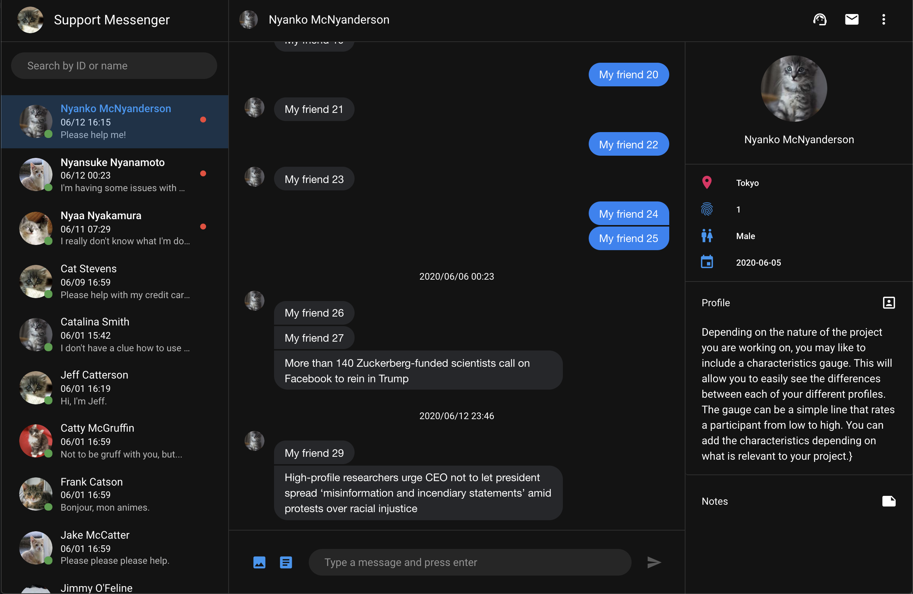

# user-client

<p align="center">
    
</p>

## Project setup
```
npm install
```

### Mock server for development
```
npm i -g json-server
npm run mock-server
```

### Compiles and hot-reloads for development
```
npm run serve
```

### Compiles and minifies for production
```
npm run build
```

### Lints and fixes files
```
npm run lint
```
